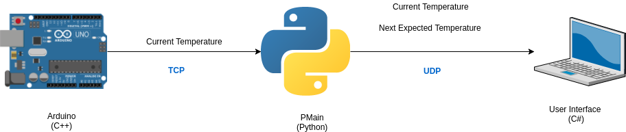
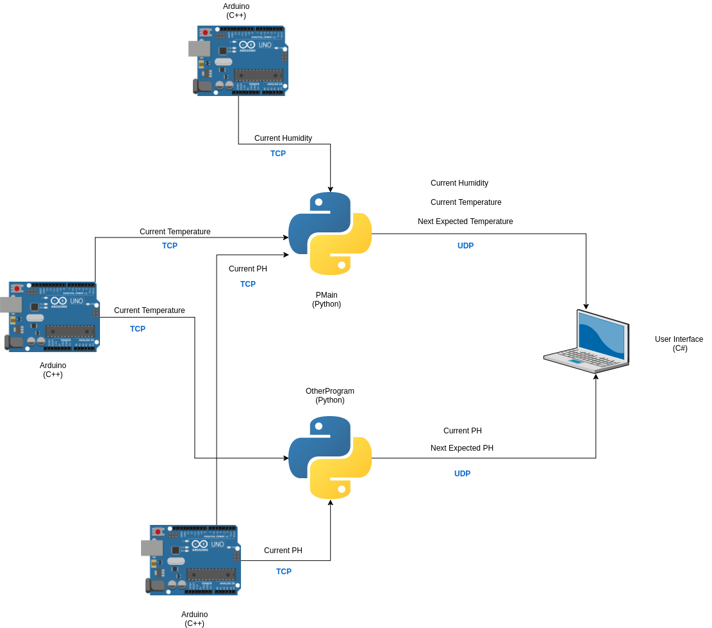
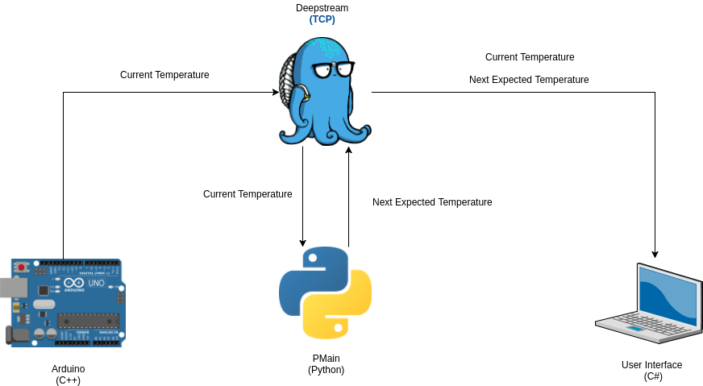
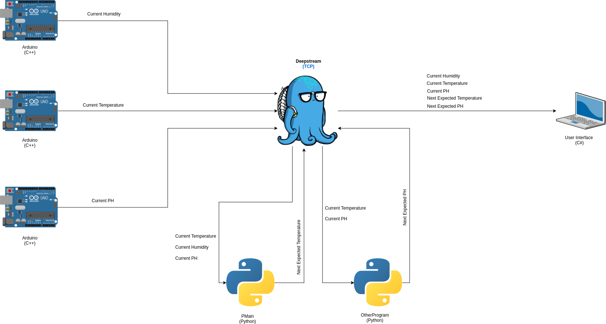

Why Use Deepstream
==================

As mentioned before, Deepstream can be considered a message broker with a data store and can deliver updates between different
applications. With the rover having sensors reading data and also needing that same data in different places
(e.g. different Python processes and the User Interface), then using Deepstream can allow us to access said data
with the same API. 

Use Case
--------

Having a message broker can be very beneficial for a system with a lot of moving parts. In order to understand this importance it is best explained
with an example without using a message broker and then contrasted with an example using a message broker.

Example (No Deepstream)
^^^^^^^^^^^^^^^^^^^^^^^

Picture an Arduino with a temperature sensor, it has a .ino file written in C++ that reads the current temperature and then needs to send
that data to a Python process, let's call it PMain. PMain will receive that current temperature and compute an expected temperature for the next
reading through some magical algorithm. PMain will run on it's own computer separate from the ardunio. Once the expected temperature is computed, PMain needs to send both the current and next expected temperature
to a User Interface to display the data to the user. Let's assume the User Interface is a native desktop application written using C# and will
run on it's own laptop. Figure 2 Illustrates the entire program layout.

**Figure 2. The layout of our 3 part program for our example.**

So here's the big question... How are we suppose to transfer data from a C++ program to Python and then to a
User Interface?

You may jump to the answer that we can execute c++ inside a python program however that won't work because remember, the arduino and python programs
are running on their own boards.

As you can see, since every part of the entire program is separated physically from each other then this narrows down the possible
solutions to our probelm.

The best possible solution would be to transfer data over the network. Therefore, relying on a network connection to handle your data being transfered
from your Arduino to PMain and then to the User Interface. However, this means deciding what network protocol to use e.g. TCP or UDP.
TCP is good if you need to make sure your data gets sent from the Arduino to PMain, however, the messages may not be delivered very quickly with all the protocol overhead
with making it fail-safe. UDP is good choice if you don't care about losing data packets and just want it to arrive as quickly as possible.
There is also HTTP and `MQTT <http://mqtt.org/>`_ as a network protocol however the one important thing to keep in mind 
is: Once you get your data sent to PMain then how will you send it to the User Interface?

You see, we need to think about all of the moving parts in our example. You may think it's as easy as 1-2-3 but then you get hit with a
baseball right to the gut. Welcome to the world of Titan Rover where things are much more complicated then they seem.

Coming off our tangent, let's decide what to do for our network requirements. Let's use TCP for sending data from the Arduino to PMain since
we want to make sure we get every temperature reading. Then, we will use UDP for sending the computed and recorded data from PMain to the 
User Interface. Figure 3 Illustrates the updated program layout.

**Figure 3. The updated layout of our 3 part program.**

Example Reflection (No Deepstream)
^^^^^^^^^^^^^^^^^^^^^^^^^^^^^^^^^^

This updated program layout works well for our example. We have each component taking care of the data and sending it down along the
stream. One thing to note, however, is that each component in our system needs to take care of sending data downstream. The more
components we add, the more those components need to be configured for passing data along. Let's go overboard and add 3 more components to our 
diagram. 

As you can see, things start to get crazy the more interconnected things you add. You also need keep track of your network endpoints of where
to send your data downstream. Let's continue our example now using a message broker.  

Example (With Deepstream)
^^^^^^^^^^^^^^^^^^^^^^^^^

Going back to our original system design, let's add Deepstream as our message broker. Figure 4 Illustrates how the program looks with Deepstream
added. Just a reminder that Deepstream operates over TCP.

**Figure 4. The 3 part program with Deepstream.**

The new design is still pretty clear on the path the data takes to get to the User Interface. I know it might not be impressive with such a
simple example so let's add deepstream to the overboard example. Figure 5 Illustrates the new overboard design with Deepstream.

**Figure 5. The overboard example with Deepstream.**

As you can see, adding Deepstream helps clear out the clutter. It is very easy to see where the data is going and offsets the burden of the 
python programs sending the new data downstream to Deepstream.

Example Reflection (With Deepstream)
^^^^^^^^^^^^^^^^^^^^^^^^^^^^^^^^^^^^

Adding a Message Broker can reduce clutter in a system design with a lot of moving parts. So how do you determine if you can benefit from a 
Message Broker in your product? Well, in the case of using Deepstream, since it offers typical features of a Message Broker plus it has a
in-cache data store, then, I would advise to analyze your system and ask the following questions:

#. Does your product compose of multiple programs needing access to the same data (one single data store)? 
#. Does your product require sending messages across your system?
#. Does your product require updates across your system in real-time (publish/subscribe events)?

If you answered yes to any of these then it might be worth looking into using something like Deepstream. However, there are some things to be
aware of if you do want to adopt a Message Broker:

#. Make sure your hardware can support the Message Broker server. 
#. Make sure there are client libraries written in the language you are using to develop your product.
#. Make sure what ever network protocol the Message Broker uses under the hood complies with your system standards (e.g. UDP or TCP).
